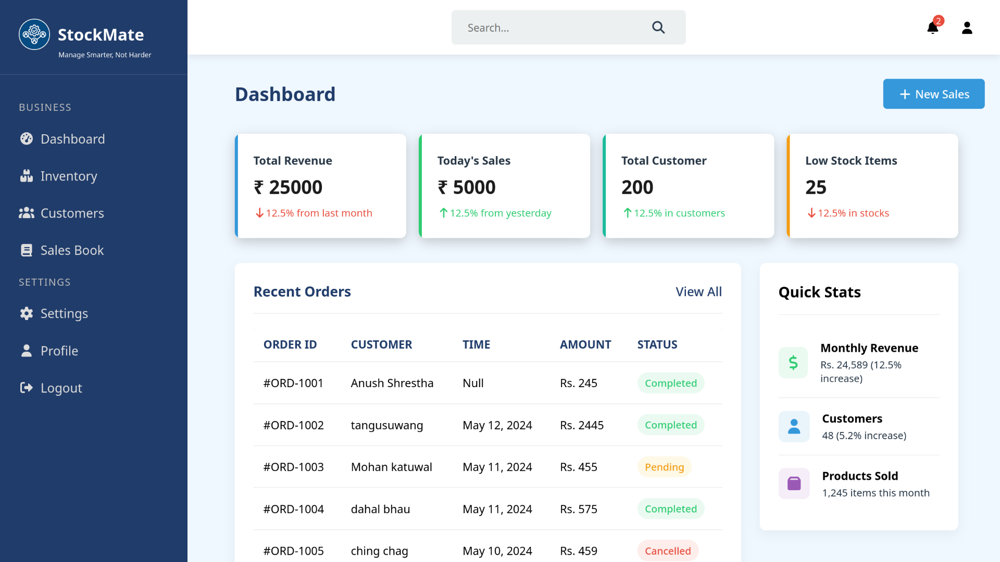
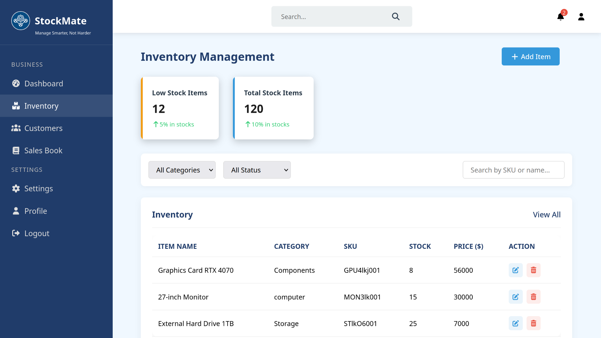

# Customer Inventory Management System


A **user-friendly frontend** built with **React,JS, HTML, and CSS** for managing customers and inventory.  
The backend (Node.js, Express, MongoDB) is handled in a separate repository.

---

## 🛠 Technologies Used (Frontend)


---

### ⚠️ Note
> The backend for this project is in a **separate repository** (Node.js, Express, MongoDB).  
You can check it out [here](https://github.com/Anush980/CIMS_Backend)

---

## 📦 Features

- **Customer Management:** Add, update, and delete customer records.  
- **Inventory Tracking:** Monitor product quantities and stock levels.  
- **Day Book:** Create and manage daily sales.  
- **User Authentication:** Login and registration integrated with backend.

---

## 🌐 Live Demo

[](https://cims-ebon.vercel.app/dashboard)

---
## 📸 Screenshots


---

## 🚀 Installation (Frontend)

1. **Clone the repository**
```bash
git clone https://github.com/Anush980/Customer_Inventory_Management_System.git
cd Customer_Inventory_Management_System
```
2. **Install dependencies**
```bash
npm install
```
3. **Set up environment variables**
 ```bash
MONGODB_URI=<your_mongodb_connection_string>
```
4. **Start the application**
```bash
npm start
```
---
Built by [Anush980](https://github.com/Anush980) – Feel free to ⭐ the repo or contribute!


   